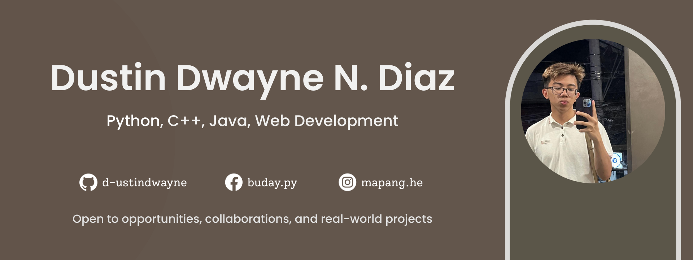

## About Me

Hi! My name is Dustin Dwayne Diaz. Currently an international student studying Software and Web Development, focused on learning by building and breaking things until they work. Currently growing skills across full-stack web, programming fundamentals, and system design.

## Skills & Technologies

| Category | Skills |
|--------|--------|
| **Programming Languages** | Python, Java, C, C++, SQL |
| **Web Technologies** | HTML, CSS, JavaScript |
| **Frameworks & Libraries** | Bootstrap, Tailwind CSS, jQuery, Vite |
| **Development Tools** | NetBeans (GUI), MySQL, MS Access |
| **Design & Documentation** | Figma, Canva, Draw.io, ERDPlus |
| **Core Concepts** | Object-Oriented Programming, Data Structures, System Analysis & Design, Human–Computer Interaction |
| **Systems & Hardware** | Windows & Linux Installation, Arduino, Microcontroller Programming |

## Contact

[**Linkedin**](https://www.linkedin.com/in/diaz5195/) | [**Facebook**](https://www.facebook.com/buday.py/) | [**Instagram**](https://www.instagram.com/mapang.he/)
