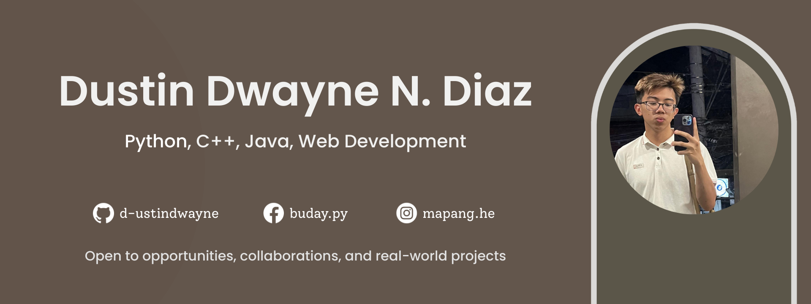

## About Me

Hi!  My name is Dustin Dwayne Diaz. Currently an international student studying Software and Web Development, focused on learning by building and breaking things until they work. Currently growing skills across full-stack web, programming fundamentals, and system design.

## Fields

- Software Development
- Full Stack Web Development
- UI/UX Design
- Data Analytics & Visualization
- Systems & IT Infrastructure
- Embedded Systems

## Skills & Technologies

| Skill Category | Technical Skills & Technologies |
|--------|--------|
| **Programming Languages** | JavaScript, TypeScript, Python, Java, C, C++, C#, PHP, Kotlin, SQL |
| **Web & Software Development** | HTML/CSS, React, React Native, Tailwind CSS, Bootstrap, Material UI, WordPress, MERN stack, JAMstack |
| **Tools & Environments** | Git, Node.js, Docker, Vite, XAMPP/MAMP/Local, Android Studio, VS Code, Figma, Power BI |
| **Hardware & Systems** | PC Assembly, Hardware & Software Troubleshooting, Windows & Linux OS Installation, Arduino |

## Contacts

